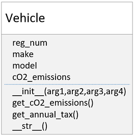
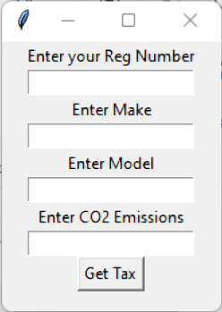

# Vehicle GUI Example

Calculating the annual tax on your Vehicle in Ireland is determined by the amount of carbon dioxide emissions your Vehicle emits.

The rules for car tax in ireland to figure out how to calculate the annual tax based on the cars CO2 emissions are laid out here https://www.gov.ie/en/publication/41c9cc-motor-tax-rates/#motor-tax-rates-2021

To simplify the exercise we will use a more straightforward version of the rule.

If the c02 emissions of the vehicle is less than or equal to 90 grammes per kilometre the tax should be €150 per year. If it is greater than 90 the tax should be €200 per year.

# Part 1
Use this rule to implement the following Vehicle.py class

The getters should return the values associated with the attributes they refer to. 
The \__str\__() function should return the reg number, make and model of the vehicle with spaces in between

# Part 2
Implement the following Simple Gui which gets data from the user about a Vehicle. Use the MyFirstGUI.py class from moodle as a starting point and modify it so that the labels read correctly and there is an additional Label and Entry field for the cO2_emissions

# Part 3
Create a function which will be called when the button is pressed. The function should instantiate a Vehicle object based on the data input by the user. The function should then out_put the annual car tax for the Vehicle. Note that self.entry.get() will return a string and the Vehicle class __init__() (constructor) function expects to get three strings and a float when instantiatiating a Vehicle Class. This means you will have to convert the cO2 from a string to a float before passing it to the constructor.

